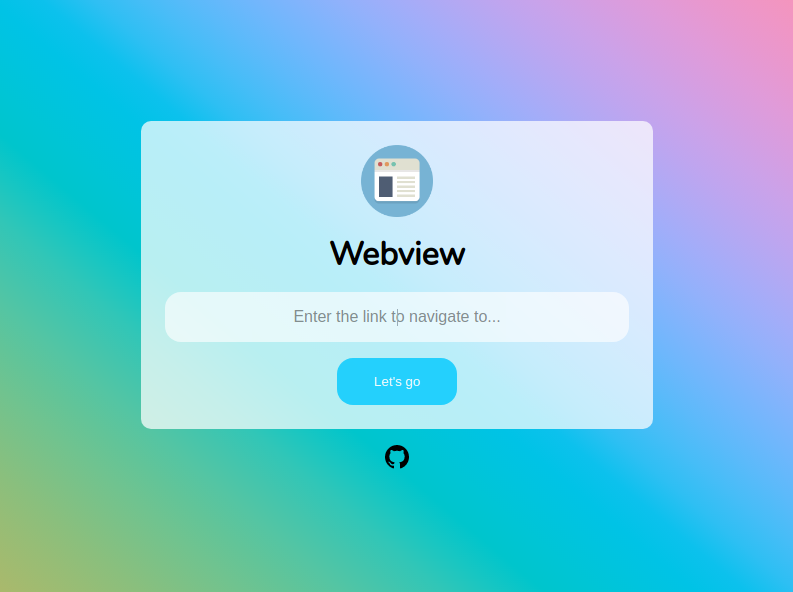

<p align="center">
  
</p>

<h1 align="center">Webview</h1>
<p align="center">A simple application focused on providing a floating window that is always on top of other windows.</p>

<h3 align="center">
  <a href="https://github.com/alissonmgsantos" target="_blank">
    
  </a>
  <a href="#" target="_blank">
    
  </a>

</h3>

<br />

## Preview

Sample preview running the app:



<br />
<br />

# ⛽ Install dependencies

```sh
npm install
```

# 🚀 Run it using

```sh
npm start
```

# 🛠️ Build

If you want to use it as an app for your OS run:

## Build for linux

```sh
npm run build:linux
```

## Build for Windows

```sh
npm run build:win
```

## Build for Mac

```sh
npm run build:mac
```

It will give to you an file in ./build directory

<br />

# 🔧 Usage & settings

After running, you can access the app settings through the tray menu.

<br />

# 👨‍💻 Techs

- Electron
- JavaScript
- HTML
- CSS

# 🤝 Contributing

Contributions, issues and feature requests are welcome!
[issues page](https://github.com/alissonmgsantos/webview/issues).

# 👤 Author

## **Alisson Matos**

- Github: [@alissonmgsantos](https://github.com/alissonmgsantos)
- LinkedIn: [@alissonmgsantos](https://linkedin.com/in/alissonmgsantos)
